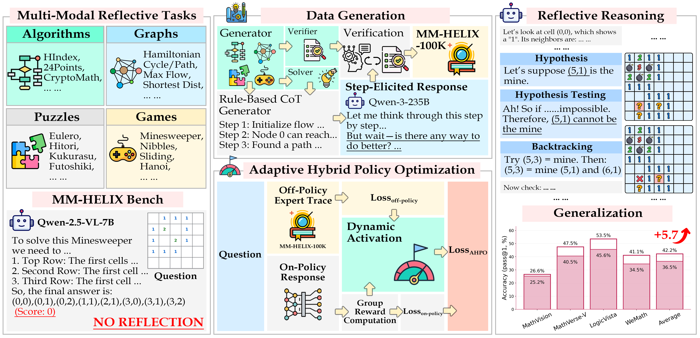
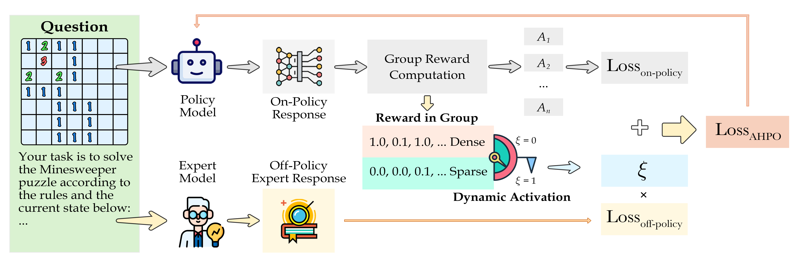
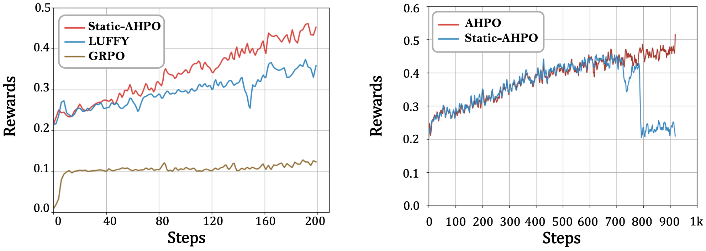
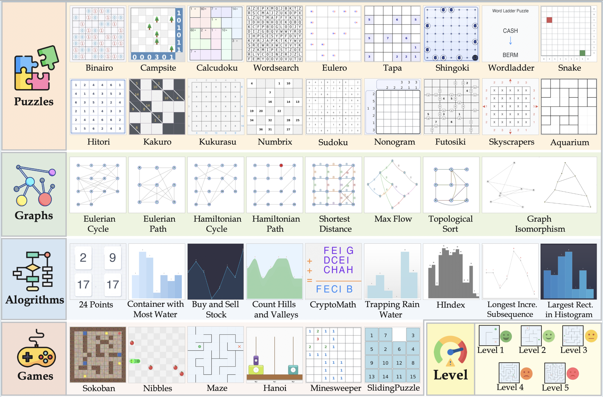
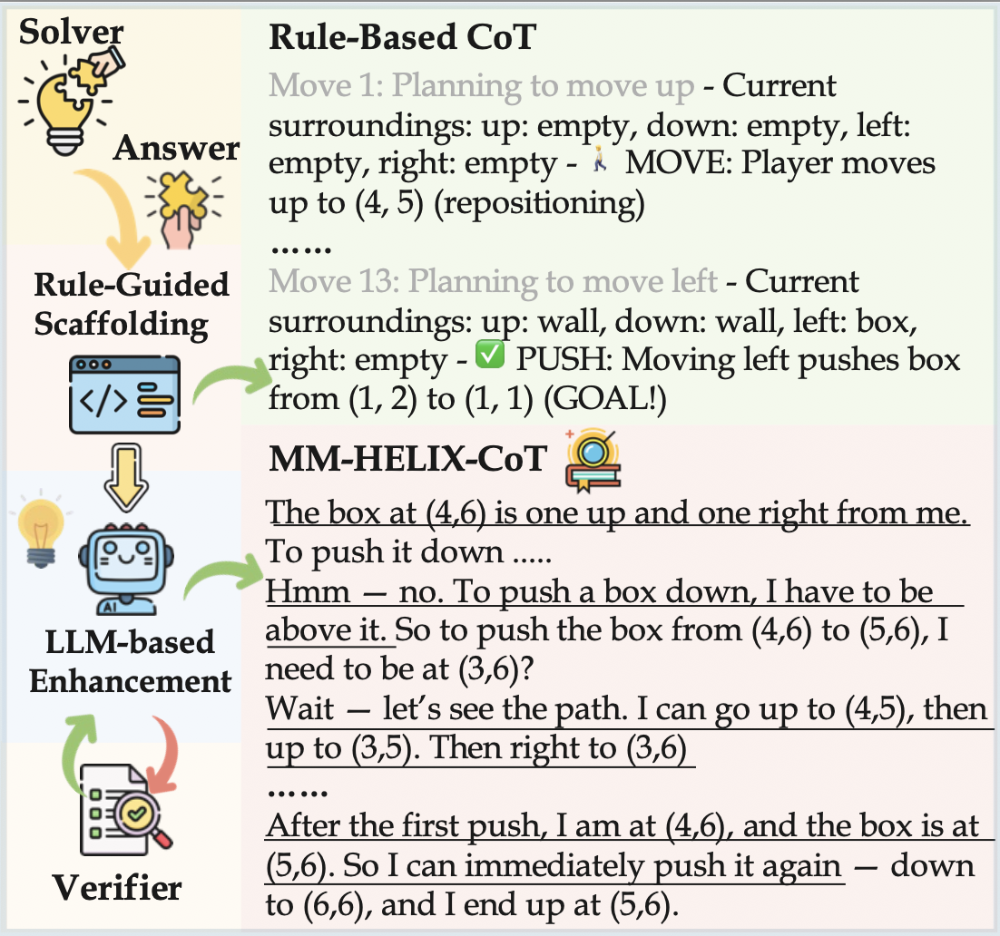

***

# MM-HELIX: Boosting Multimodal Long-Chain Reflective Reasoning with Holistic Platform and Adaptive Hybrid Policy Optimization

<p align="center">
        🌐 <a href="https://mm-helix.github.io/">HomePage</a>&nbsp&nbsp | &nbsp&nbsp📖 <a href="https://arxiv.org/abs/2510.08540">Paper</a>&nbsp&nbsp | &nbsp&nbsp🏆 <a href="">Leaderboard</a>
<br>
🤗 <a href="https://huggingface.co/PhoenixZ/MM-HELIX-7B-Thinking">MM-HELIX-7B-Thinking</a>&nbsp&nbsp | &nbsp&nbsp🤗 <a href="https://huggingface.co/datasets/tianhao2k/MM-HELIX">MM-HELIX Benchmark</a>&nbsp&nbsp | &nbsp&nbsp🤗 <a href="https://huggingface.co/datasets/mjuicem/MM-HELIX-100K">MM-HELIX-100K</a>
</p>

<p align="center">
  
</p>

## Introduction

While Multimodal Large Language Models (MLLMs) have shown proficiency in tasks like mathematics and logic, their ability for **long-chain reflective reasoning**—a key element for solving complex, real-world problems—is not fully developed. This type of reasoning requires iterative thinking and backtracking, which current models often lack.

**MM-HELIX** is a comprehensive platform designed to **evaluate** and **enhance** this crucial capability in MLLMs. It consists of:

*   **A Challenging Benchmark:** A new benchmark, MM-HELIX, featuring 1,260 instances across 42 difficult tasks that demand reflective reasoning. Our findings show that existing MLLMs struggle significantly on this benchmark.
*   **A High-Quality Dataset:** To address the performance gap, we created MM-HELIX-100K, a dataset with 100,000 high-quality, reflective reasoning instruction-tuning samples, generated through our innovative **Step-Elicited Response Generation (SERG)** pipeline.
*   **An Advanced Training Method:** We introduce **Adaptive Hybrid Policy Optimization (AHPO)**, a novel training strategy that combines offline supervision with online optimization. This method effectively teaches the model to learn from expert data and explore solutions independently, overcoming issues like sparse rewards and catastrophic forgetting that are common in standard Reinforcement Learning.

Our model, based on Qwen2.5-VL-7B, shows a **+18.6%** improvement in accuracy on the MM-HELIX benchmark and a **+5.7%** average gain on general math and logic tasks, demonstrating that reflective reasoning can be effectively learned and generalized.

## To-Do List

-   [✅] `2025.10.13` **42 SandBox Tasks Generation Code**, refer to [sandbox](sandbox/README.md)
-   [✅] `2025.10.08` **Arxiv Paper**
-   [✅] `2025.10.08` **MM-HELIX-100K Dataset**
-   [✅] `2025.10.08` **MM-HELIX Benchmark**
-   [✅] `2025.10.08` **Evaluation Code in [VLMEvalkit](https://github.com/open-compass/VLMEvalKit)**
-   [✅] `2025.09.30` **MM-HELIX-7B-Thinking Model Checkpoint**
-   [⏳] **AHPO Training Code & RL Environment** [*Coming Soon*]
-   [⏳] **Step Elicited Response Generation(SERG) Pipeline** [*Coming Soon*]


## Adaptive Hybrid Policy Optimization (AHPO)

Standard training methods often fall short in complex reasoning tasks. Supervised Fine-Tuning (SFT) can lead to catastrophic forgetting of general capabilities, while on-policy Reinforcement Learning (RL) is inefficient with sparse rewards.

To solve these issues, we developed **Adaptive Hybrid Policy Optimization (AHPO)**, a novel training algorithm that unifies off-policy supervision and on-policy exploration.

<p align="center">
  
</p>

AHPO's adaptive mechanism dynamically adjusts the influence of expert data based on the model's performance. When the model struggles (sparse rewards), it relies more on expert guidance. As it improves, it is encouraged to explore and find new solutions on its own. This approach fosters robust and generalizable reasoning skills.

<p align-center>
  
</p>


## MM-HELIX Benchmark

<p align="center">
  
  <em><p align="center">The 42 tasks in the MM-HELIX benchmark.</p></em>
</p>

The **MM-HELIX benchmark** is designed to test the limits of multimodal long-chain reflective reasoning in MLLMs.

*   **Diverse and Challenging Tasks:** The benchmark includes 1,260 high-quality samples from 42 unique tasks divided into four categories: **algorithms, graphs, puzzles, and games**.


*   **Controlled Difficulty:** Tasks are generated procedurally with five levels of difficulty, from Level 1 (very easy) to Level 5 (very hard), allowing for a detailed analysis of model performance at different complexities.

*   **Automated and Objective Evaluation:** Our framework includes an **Instance Generator**, a deterministic **Solver**, and an automated **Verifier**. The Verifier validates the correctness of model-generated solutions, enabling objective and scalable evaluation, and also serves as a reward oracle in a reinforcement learning setup.


## MM-HELIX-100K Dataset: High-Quality Multimodal Reflective CoT

To train models for complex reasoning, a large-scale, high-quality dataset is essential. We introduce **MM-HELIX-100K**, a dataset of 100,000 instruction-tuning instances with detailed, reflective reasoning paths.

This dataset was created using our **Step-Elicited Response Generation (SERG)** pipeline, which efficiently generates high-quality Chain-of-Thought (CoT) trajectories.

The SERG pipeline works as follows:
1.  A rule-based CoT constructor first generates a skeletal reasoning path.
2.  This path is then refined by a powerful language model (Qwen3-235B) to create a more natural, human-like reasoning process that includes reflective steps.
3.  Finally, each generated trajectory is validated by our automated verifier to ensure its correctness and quality.

<p align="center">
  
  <em><p align="center">The Step-Elicited Response Generation (SERG) pipeline.</p></em>
</p>


## MM-HELIX Leaderboard

Our comprehensive evaluation of 23 leading MLLMs on the MM-HELIX benchmark reveals significant limitations in their reflective reasoning abilities. Even top proprietary models struggle to surpass a 50% accuracy threshold, and a notable performance gap exists between multimodal and text-only inputs.
<table>
<thead>
<tr>
<th rowspan="3" style="text-align: left;">Model</th>
<th rowspan="3" style="text-align: center;">Thinking</th>
<th colspan="8" style="text-align: center;">Breakdown by Category</th>
<th colspan="2" rowspan="2" style="text-align: center;">Overall</th>
</tr>
<tr>
<th colspan="2" style="text-align: center;">Algorithms</th>
<th colspan="2" style="text-align: center;">Graphs</th>
<th colspan="2" style="text-align: center;">Puzzles</th>
<th colspan="2" style="text-align: center;">Games</th>
</tr>
<tr>
<th style="text-align: center;"><em>Txt</em></th>
<th style="text-align: center;"><em>Img</em></th>
<th style="text-align: center;"><em>Txt</em></th>
<th style="text-align: center;"><em>Img</em></th>
<th style="text-align: center;"><em>Txt</em></th>
<th style="text-align: center;"><em>Img</em></th>
<th style="text-align: center;"><em>Txt</em></th>
<th style="text-align: center;"><em>Img</em></th>
<th style="text-align: center;"><em>Txt</em></th>
<th style="text-align: center;"><em>Img</em></th>
</tr>
</thead>
<tbody>
<tr>
<td colspan="12" style="text-align: center; font-style: italic;">Proprietary Models</td>
</tr>
<tr>
<td style="text-align: left;">GPT-5</td>
<td style="text-align: center;">✅</td>
<td style="text-align: center;">83.0</td>
<td style="text-align: center;">88.5</td>
<td style="text-align: center;">98.3</td>
<td style="text-align: center;">50.4</td>
<td style="text-align: center;">80.9</td>
<td style="text-align: center;">52.6</td>
<td style="text-align: center;">80.0</td>
<td style="text-align: center;">40.0</td>
<td style="text-align: center;">84.5</td>
<td style="text-align: center;">58.1</td>
</tr>
<tr>
<td style="text-align: left;">Seed-1.5-VL</td>
<td style="text-align: center;">✅</td>
<td style="text-align: center;">89.3</td>
<td style="text-align: center;">78.9</td>
<td style="text-align: center;">86.7</td>
<td style="text-align: center;">40.4</td>
<td style="text-align: center;">51.6</td>
<td style="text-align: center;">41.9</td>
<td style="text-align: center;">55.6</td>
<td style="text-align: center;">33.3</td>
<td style="text-align: center;">66.9</td>
<td style="text-align: center;">48.3</td>
</tr>
<tr>
<td style="text-align: left;">o4-mini</td>
<td style="text-align: center;">✅</td>
<td style="text-align: center;">76.3</td>
<td style="text-align: center;">50.7</td>
<td style="text-align: center;">95.0</td>
<td style="text-align: center;">42.1</td>
<td style="text-align: center;">69.1</td>
<td style="text-align: center;">45.8</td>
<td style="text-align: center;">66.7</td>
<td style="text-align: center;">35.6</td>
<td style="text-align: center;">75.2</td>
<td style="text-align: center;">44.7</td>
</tr>
<tr>
<td style="text-align: left;">Gemini-2.5-Flash</td>
<td style="text-align: center;">✅</td>
<td style="text-align: center;">92.6</td>
<td style="text-align: center;">66.7</td>
<td style="text-align: center;">88.3</td>
<td style="text-align: center;">40.8</td>
<td style="text-align: center;">52.1</td>
<td style="text-align: center;">36.7</td>
<td style="text-align: center;">49.4</td>
<td style="text-align: center;">28.3</td>
<td style="text-align: center;">67.3</td>
<td style="text-align: center;">42.7</td>
</tr>
<tr>
<td style="text-align: left;">GPT-4.1</td>
<td style="text-align: center;">❌</td>
<td style="text-align: center;">61.9</td>
<td style="text-align: center;">44.4</td>
<td style="text-align: center;">73.8</td>
<td style="text-align: center;">35.0</td>
<td style="text-align: center;">30.9</td>
<td style="text-align: center;">16.8</td>
<td style="text-align: center;">13.9</td>
<td style="text-align: center;">8.9</td>
<td style="text-align: center;">43.3</td>
<td style="text-align: center;">25.1</td>
</tr>
<tr>
<td style="text-align: left;">GPT-4o</td>
<td style="text-align: center;">❌</td>
<td style="text-align: center;">33.7</td>
<td style="text-align: center;">18.9</td>
<td style="text-align: center;">44.6</td>
<td style="text-align: center;">25.4</td>
<td style="text-align: center;">10.2</td>
<td style="text-align: center;">4.2</td>
<td style="text-align: center;">10.6</td>
<td style="text-align: center;">6.7</td>
<td style="text-align: center;">21.8</td>
<td style="text-align: center;">11.7</td>
</tr>
<tr>
<td colspan="12" style="text-align: center; font-style: italic;">Open-Source Models</td>
</tr>
<tr>
<td style="text-align: left;">Intern-S1-241B-A28B</td>
<td style="text-align: center;">✅</td>
<td style="text-align: center;">75.2</td>
<td style="text-align: center;">69.3</td>
<td style="text-align: center;">76.7</td>
<td style="text-align: center;">30.0</td>
<td style="text-align: center;">35.3</td>
<td style="text-align: center;">23.5</td>
<td style="text-align: center;">26.1</td>
<td style="text-align: center;">15.0</td>
<td style="text-align: center;">50.4</td>
<td style="text-align: center;">33.3</td>
</tr>
<tr>
<td style="text-align: left;">GLM-4.5V-106B-A12B-Thinking</td>
<td style="text-align: center;">✅</td>
<td style="text-align: center;">49.6</td>
<td style="text-align: center;">29.3</td>
<td style="text-align: center;">40.4</td>
<td style="text-align: center;">11.3</td>
<td style="text-align: center;">15.3</td>
<td style="text-align: center;">20.2</td>
<td style="text-align: center;">12.2</td>
<td style="text-align: center;">13.9</td>
<td style="text-align: center;">27.0</td>
<td style="text-align: center;">19.5</td>
</tr>
<tr>
<td style="text-align: left;">Kimi-VL-16B-A3B-Thinking-2506</td>
<td style="text-align: center;">✅</td>
<td style="text-align: center;">45.9</td>
<td style="text-align: center;">36.3</td>
<td style="text-align: center;">49.6</td>
<td style="text-align: center;">23.3</td>
<td style="text-align: center;">9.6</td>
<td style="text-align: center;">10.4</td>
<td style="text-align: center;">10.6</td>
<td style="text-align: center;">7.2</td>
<td style="text-align: center;">28.9</td>
<td style="text-align: center;">19.3</td>
</tr>
<tr>
<td style="text-align: left;">GLM-4.1V-9B-Thinking</td>
<td style="text-align: center;">✅</td>
<td style="text-align: center;">38.1</td>
<td style="text-align: center;">30.7</td>
<td style="text-align: center;">50.4</td>
<td style="text-align: center;">29.2</td>
<td style="text-align: center;">11.6</td>
<td style="text-align: center;">7.4</td>
<td style="text-align: center;">5.0</td>
<td style="text-align: center;">6.1</td>
<td style="text-align: center;">23.7</td>
<td style="text-align: center;">16.3</td>
</tr>
<tr>
<td style="text-align: left;">Qwen-2.5-VL-72B</td>
<td style="text-align: center;">❌</td>
<td style="text-align: center;">24.4</td>
<td style="text-align: center;">18.5</td>
<td style="text-align: center;">42.1</td>
<td style="text-align: center;">25.8</td>
<td style="text-align: center;">8.2</td>
<td style="text-align: center;">3.9</td>
<td style="text-align: center;">5.6</td>
<td style="text-align: center;">7.2</td>
<td style="text-align: center;">20.1</td>
<td style="text-align: center;">13.9</td>
</tr>
<tr>
<td style="text-align: left;">Qwen-2.5-VL-32B</td>
<td style="text-align: center;">❌</td>
<td style="text-align: center;">22.2</td>
<td style="text-align: center;">15.2</td>
<td style="text-align: center;">46.3</td>
<td style="text-align: center;">22.5</td>
<td style="text-align: center;">8.1</td>
<td style="text-align: center;">4.7</td>
<td style="text-align: center;">5.6</td>
<td style="text-align: center;">6.7</td>
<td style="text-align: center;">20.6</td>
<td style="text-align: center;">12.3</td>
</tr>
<tr>
<td style="text-align: left;">QVQ-72B-Preview</td>
<td style="text-align: center;">✅</td>
<td style="text-align: center;">22.6</td>
<td style="text-align: center;">21.1</td>
<td style="text-align: center;">36.7</td>
<td style="text-align: center;">16.7</td>
<td style="text-align: center;">4.9</td>
<td style="text-align: center;">3.3</td>
<td style="text-align: center;">6.7</td>
<td style="text-align: center;">3.3</td>
<td style="text-align: center;">17.7</td>
<td style="text-align: center;">11.1</td>
</tr>
<tr>
<td style="text-align: left;">MiniCPM-V-4.5-8B</td>
<td style="text-align: center;">✅</td>
<td style="text-align: center;">20.0</td>
<td style="text-align: center;">20.0</td>
<td style="text-align: center;">32.1</td>
<td style="text-align: center;">20.8</td>
<td style="text-align: center;">5.8</td>
<td style="text-align: center;">3.7</td>
<td style="text-align: center;">0.0</td>
<td style="text-align: center;">3.3</td>
<td style="text-align: center;">13.0</td>
<td style="text-align: center;">10.4</td>
</tr>
<tr>
<td style="text-align: left;">InternVL3-78B</td>
<td style="text-align: center;">❌</td>
<td style="text-align: center;">20.0</td>
<td style="text-align: center;">14.4</td>
<td style="text-align: center;">43.3</td>
<td style="text-align: center;">25.4</td>
<td style="text-align: center;">10.2</td>
<td style="text-align: center;">4.0</td>
<td style="text-align: center;">10.0</td>
<td style="text-align: center;">1.1</td>
<td style="text-align: center;">18.6</td>
<td style="text-align: center;">9.9</td>
</tr>
<tr>
<td style="text-align: left;">InternVL3-38B</td>
<td style="text-align: center;">❌</td>
<td style="text-align: center;">19.3</td>
<td style="text-align: center;">14.1</td>
<td style="text-align: center;">40.8</td>
<td style="text-align: center;">22.5</td>
<td style="text-align: center;">8.2</td>
<td style="text-align: center;">3.5</td>
<td style="text-align: center;">7.8</td>
<td style="text-align: center;">5.6</td>
<td style="text-align: center;">16.7</td>
<td style="text-align: center;">9.7</td>
</tr>
<tr>
<td style="text-align: left;">Llama-4-Scout-109B-A17B-16E</td>
<td style="text-align: center;">❌</td>
<td style="text-align: center;">24.1</td>
<td style="text-align: center;">16.3</td>
<td style="text-align: center;">40.8</td>
<td style="text-align: center;">21.3</td>
<td style="text-align: center;">4.4</td>
<td style="text-align: center;">4.2</td>
<td style="text-align: center;">2.2</td>
<td style="text-align: center;">1.7</td>
<td style="text-align: center;">15.2</td>
<td style="text-align: center;">9.7</td>
</tr>
<tr>
<td style="text-align: left;">Ovis2-34B</td>
<td style="text-align: center;">❌</td>
<td style="text-align: center;">14.4</td>
<td style="text-align: center;">10.4</td>
<td style="text-align: center;">33.8</td>
<td style="text-align: center;">22.1</td>
<td style="text-align: center;">3.9</td>
<td style="text-align: center;">1.2</td>
<td style="text-align: center;">5.0</td>
<td style="text-align: center;">1.7</td>
<td style="text-align: center;">12.0</td>
<td style="text-align: center;">7.2</td>
</tr>
<tr>
<td style="text-align: left;">Gemma-3-27B-IT</td>
<td style="text-align: center;">❌</td>
<td style="text-align: center;">20.7</td>
<td style="text-align: center;">10.4</td>
<td style="text-align: center;">44.2</td>
<td style="text-align: center;">22.1</td>
<td style="text-align: center;">6.5</td>
<td style="text-align: center;">0.5</td>
<td style="text-align: center;">5.6</td>
<td style="text-align: center;">1.7</td>
<td style="text-align: center;">16.6</td>
<td style="text-align: center;">6.9</td>
</tr>
<tr>
<td style="text-align: left;">Qwen-2.5-VL-7B</td>
<td style="text-align: center;">❌</td>
<td style="text-align: center;">5.6</td>
<td style="text-align: center;">5.9</td>
<td style="text-align: center;">25.4</td>
<td style="text-align: center;">17.9</td>
<td style="text-align: center;">0.4</td>
<td style="text-align: center;">0.4</td>
<td style="text-align: center;">0.6</td>
<td style="text-align: center;">1.1</td>
<td style="text-align: center;">8.0</td>
<td style="text-align: center;">6.3</td>
</tr>
<tr>
<td style="text-align: left;">InternVL3-8B</td>
<td style="text-align: center;">❌</td>
<td style="text-align: center;">8.1</td>
<td style="text-align: center;">5.9</td>
<td style="text-align: center;">28.8</td>
<td style="text-align: center;">16.7</td>
<td style="text-align: center;">1.6</td>
<td style="text-align: center;">0.7</td>
<td style="text-align: center;">1.1</td>
<td style="text-align: center;">1.1</td>
<td style="text-align: center;">8.1</td>
<td style="text-align: center;">4.9</td>
</tr>
<tr>
<td style="text-align: left;">Ovis2-8B</td>
<td style="text-align: center;">❌</td>
<td style="text-align: center;">7.8</td>
<td style="text-align: center;">3.3</td>
<td style="text-align: center;">24.2</td>
<td style="text-align: center;">15.4</td>
<td style="text-align: center;">0.5</td>
<td style="text-align: center;">0.2</td>
<td style="text-align: center;">1.1</td>
<td style="text-align: center;">0.6</td>
<td style="text-align: center;">6.7</td>
<td style="text-align: center;">3.8</td>
</tr>
<tr>
<td colspan="12" style="text-align: center; font-style: italic;">Ours</td>
</tr>
<tr>
<td style="text-align: left;"><b>MM-HELIX-7B-Thinking</b></td>
<td style="text-align: center;">✅</td>
<td style="text-align: center;"><b>32.2</b></td>
<td style="text-align: center;"><b>34.8</b></td>
<td style="text-align: center;"><b>27.5</b></td>
<td style="text-align: center;"><b>19.2</b></td>
<td style="text-align: center;"><b>16.3</b></td>
<td style="text-align: center;"><b>25.3</b></td>
<td style="text-align: center;"><b>16.1</b></td>
<td style="text-align: center;"><b>16.7</b></td>
<td style="text-align: center;"><b>21.8</b></td>
<td style="text-align: center;"><b>24.9</b></td>
</tr>
</tbody>
</table>
<p align="center">

  <em><p align="center"><b>Table 1:</b> Evaluation results on MM-HELIX across multimodal and text-only settings.</p></em>
</p>

## Training Performance

When applying AHPO to the Qwen2.5-VL-7B model, we observed remarkable improvements. Our final model, **MM-HELIX-7B-Thinking**, not only achieves a **+18.6%** absolute improvement on the MM-HELIX benchmark but also demonstrates strong generalization with a **+5.7%** average gain on general math and logic benchmarks.
| Method | Type | **In-Domain** |  | | General Reasoning| | |
| :--- | :--- | :---: | :---: | :---: | :---: | :---: | :---: |
| | | **MM-HELIX** | **MathVision** | **MathVerse-V** | **LogicVista** | **WeMath** | **Average** |
| **Qwen2.5VL-7B** | Baseline | 6.3 | 25.2 | 40.5 | 45.6 | 34.5 | 36.5 |
| **+GRPO** | On-policy | 9.0(+2.7) | 25.8 | 41.0 | 43.6 | 36.4 | 36.7(+0.2) |
| **+SFT** | Off-policy | 23.8(+17.5) | 21.7 | 33.0 | 38.7 | 26.2 | 29.9(-6.6) |
| **+SFT&GRPO** | Sequential | 23.3(+17.0) | 25.9 | 39.1 | 45.9 | 35.7 | 36.7(+0.2) |
| **+LUFFY** | Hybrid | 9.1(+2.8) | 26.0 | 37.9 | 42.7 | 34.8 | 35.4(-1.1) |
| **+AHPO (Ours)** | **Hybrid** | **24.9(+18.6)** | **26.6** | **47.5** | **53.5** | **41.1** | **42.2(+5.7)** |
<p align="center">
  <em><p align="center"><b>Table 2:</b> Comparison of AHPO and other training strategies.</p></em>
</p>

For detailed results and rankings, please refer to our interactive leaderboard.


## Citation

If you find our work useful, please consider citing our paper:
```bibtex
@article{zhao2025mmhelix,
  title={MM-HELIX: Boosting Multimodal Long-Chain Reflective Reasoning with Holistic Platform and Adaptive Hybrid Policy Optimization},
  author={Zhao, Xiangyu and Lin, Junming and Liang, Tianhao and Zhou, Yifan and Chai, Wenhao and Gu, Yuzhe and Wang, Weiyun and Chen, Kai and Luo, Gen and Zhang, Wenwei and Yan, Junchi and Yang, Hua and Duan, Haodong and Yang, Xue},
  journal={arXiv preprint arXiv:2510.08540},
  year={2025}
}
```
